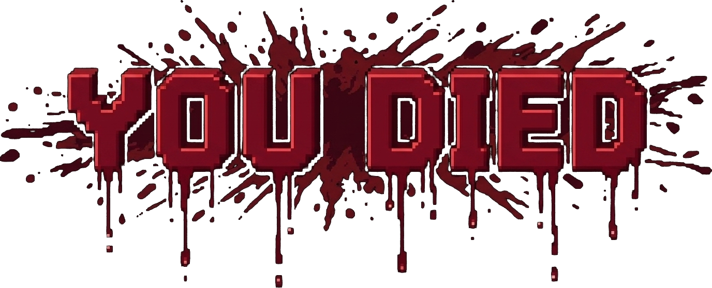

# DeathStats for Luanti

A cinematic, pixel art-themed death screen and lifetime player statistics mod for Luanti.



## Features

- **Cinematic Death Presentation**:
  - Custom pixel art "YOU DIED" banner with blood dripping font.
  - Visceral "slapped on screen from distance" animation: accelerates forward from distant perspective, impacts the screen glass with an overshoot bounce, settling firmly into view with synchronous subtitle reveal.
  - Fullscreen pixel art blood splatter and dark vignette overlay.
  - Dynamic camera perspective:
    - **Smooth Circular Orbit**: Smoothly orbits around the fallen player corpse or bones block in a circular path in first-person mode, eliminating third-person camera offsets.
    - **Corpse Placeholder Entity**: Spawns an immortal, non-physical corpse mesh entity lying flat on the ground that inherits the player's exact character model and composite skins across `skinsdb`, `simple_skins`, `wardrobe`, `3d_armor`, `clothing`, `player_api`, and `mcl_skins`.
    - **Atmospheric Corpse Particles**: Spawns natural particle effects from the corpse:
      - **Water**: continuous animated bubbling air bubbles (5x5 px pixel art) floating upward through water.
      - **Lava**: continuous animated licking fire & ember sparks (5x5 px pixel art) leaping with high glow.
      - **Fire**: continuous animated billowing ash smoke (5x5 px pixel art) drifting upward.
      - **All Others**: dynamic burst of surface node particles flying upward from ground impact at the moment of death with customized gravity and velocity.
    - **Obstacle Avoidance**: Raycasts line-of-sight between camera and corpse, dynamically pulling camera in front of solid walls to eliminate clipping.
    - **Bones Mod Compatibility**: Respects `bones_mode` setting. When `bones_mode == "bones"`, suppresses the corpse entity so the placed bones block is directly visible and fully functional (retaining stored inventory and item drop mechanics), automatically locking camera orbit directly onto the bones. When `bones` is disabled or in `drop`/`keep` mode, falls back to the cinematic corpse entity.
    - **Early Item Drops**: If the game drops inventory on death (`bones_mode == "drop"`, etc.), items scatter around the death position with randomized velocity right as the orbit begins.
  - Clean cinematic display: in-game hotbar and HUDs automatically hidden during death.

- **Intelligent Death Cause & Weapon Detection**:
  - Identifies killers (players or mobs), weapon/tool used for the killing blow (swords, tools, bare hands).
  - Full projectile & ranged weapon attribution: tracks kills and damage from arrows (`x_bows`), sword projectiles (`x_obsidianmese`), and custom ranged weapons directly to the shooter player.
  - Full mob combat damage tracking: tracks all damage dealt to mobs across `mobs_redo`, `creatura`, and custom entities.
  - Robust fallback environmental inspection when engine `reason` is `nil` or generic: detects drowning (breath/water), lava melting, burning in fire, falling impact velocity, suffocation in solid blocks, falling into the void, and hunger starvation.
  - **Hunger & Starvation Integration**: Seamlessly detects starvation deaths across popular hunger frameworks including `hbhunger`, `hudbars`, `stamina`, `hunger_ng`, and `mcl_hunger` (even when damage is applied via generic `set_hp` calls).
  - Hilarious, curated epitaph notes for every cause of death in high-contrast white text.

- **Interactive Death Interface (Modern Formspec v6)**:
  - **Try Again**: Instant respawn, clean HUD removal, and camera restore.
  - **Side-Docked Last Life Card**: Compact summary displaying time survived, blocks mined, total ores mined, damage dealt & taken with clear labels, mobs & players slain, items crafted & consumed, and distance traveled. Positioned neatly on the side of the screen so the fallen player model and death location remain completely unobstructed.
  - **More Statistics (Lifetime Dossier)**: Comprehensive interactive dashboard with transparent backdrop and accessible tab styling, persistent across server restarts using Luanti's Mod Storage:
    - **Overview Tab**: Total playtime, total deaths, K/D ratio, damage statistics, building and survival records.
    - **Ores Breakdown Tab**: Dynamic scrollable 2-column grid showing every single ore variety extracted with item icons, exact counts, and sorted rankings.
    - **Combat & Mobs Tab**: Dynamic scrollable 2-column grid of mobs and players slain with individual kill counts.

## Configuration

The following options can be customized in `minetest.conf` or the in-game Settings menu:
- `deathstats_enable_sounds = true` (toggle death sound effects)
- `deathstats_enable_camera = true` (toggle cinematic camera orbit on death)
- `deathstats_orbit_radius = 3.2` (orbit circle radius in nodes)
- `deathstats_orbit_height = 1.5` (orbit camera height above corpse in nodes)
- `deathstats_orbit_speed = 0.4` (orbit rotation speed in rad/s, ~15.7s for full circle)
- `deathstats_enable_animation = true` (toggle zoom & fade animation)
- `deathstats_animation_duration = 2.4` (duration of screen slap animation in seconds)
- `deathstats_blood_opacity = 240` (opacity of blood splatter overlay, 0-255)
- `deathstats_formspec_side = right` (`right`, `left`, or `center` screen alignment)

- **Sound Effects**:
  - Plays authentic CC0 sound cues from Freesound picked at random on death (retro 8-bit game over, dark bell chime, dramatic defeat impact). Supported sound groups automatically resolve across Luanti engine sound variants (`deathstats_death.1.ogg`, `deathstats_death.2.ogg`, `deathstats_death.3.ogg`).

- **Multiplayer Performance**:
  - High performance, memory-efficient in-memory tracking ($O(1)$ operations).
  - Asynchronous / zero-lag Mod Storage persistence upon death, disconnect, and server shutdown.
  - Clean fallbacks for all engine versions.

## Sound Credits (Freesound CC0 / Public Domain)
- `deathstats_death.1.ogg`: by krega (CC0, Freesound)
- `deathstats_death.2.ogg`: by krega (CC0, Freesound)
- `deathstats_death.3.ogg`: by krega (CC0, Freesound)
- `deathstats_death.4.ogg`: by krega (CC0, Freesound)
- `deathstats_death.5.ogg`: by krega (CC0, Freesound)

## Testing

DeathStats includes automated unit tests covering death reason analysis, live stat tracking, formspec layouts, corpse mechanics, and reconnect persistence:

```bash
lua test.lua
```

## License
- **Code**: LGPL-2.1 or later (C) 2026 SaKeL
- **Textures & Art**: CC0 / Public Domain
- **Sounds**: CC0 / Public Domain

