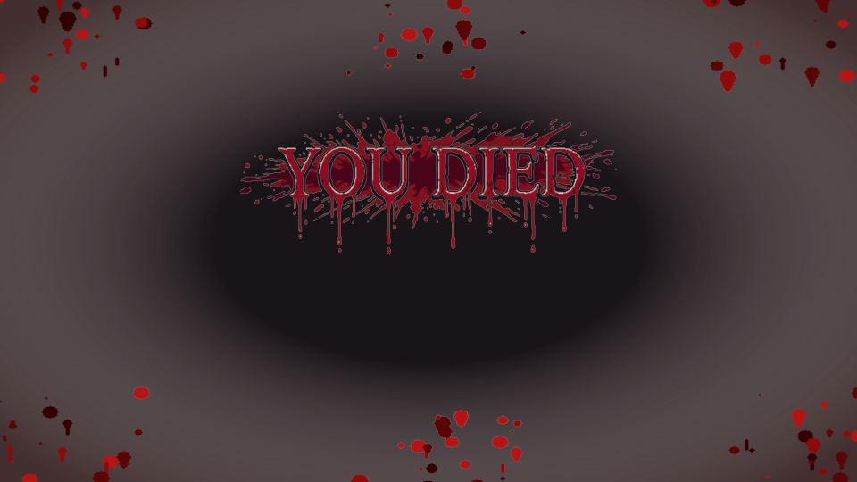

# DeathStats for Luanti

A cinematic, pixel art-themed death screen and lifetime player statistics mod for Luanti.



## Features

- **Cinematic Death Presentation**:
  - **Dynamic Thematic Banners & Vignette Overlays**:
    The "YOU DIED" banner typography and fullscreen vignette backdrop dynamically adapt to the cause of death:
    - **Lava / Magma**: Molten glowing lava banner (`deathstats_you_died_lava.png`) and intense magma splatter with fiery embers vignette (`deathstats_lava_splatter.png`).
    - **Fire / Burning**: Burning scorched flame banner (`deathstats_you_died_fire.png`) and charred ash smoke with flame splatter vignette (`deathstats_fire_splatter.png`).
    - **Drowning / Water**: Submerged waterlogged banner (`deathstats_you_died_drown.png`) and underwater splash droplets with aquatic blue vignette (`deathstats_drown_splatter.png`).
    - **Combat, Fall, Starvation, Suffocation, Void & Generic**: Iconic dripping crimson blood banner (`deathstats_you_died.png`) and visceral blood splatter with dark vignette (`deathstats_blood_splatter.png`).
  - Visceral "slapped on screen from distance" animation: accelerates forward from distant perspective, impacts the screen glass with an overshoot bounce, settling firmly into view with synchronous subtitle reveal.
  - Dynamic camera perspective:
    - **Smooth Circular Orbit**: Smoothly orbits around the fallen player corpse or bones block in a circular path in first-person mode, eliminating third-person camera offsets.
    - **Corpse Placeholder Entity**: Spawns an immortal, non-physical corpse mesh entity lying flat on the ground that inherits the player's exact character model, wielditem, and composite skins across 13+ appearance mods (`skinsdb`, `3d_armor`, `clothing`, `player_api`, `mcl_skins`, `simple_skins`, `wardrobe`, `edit_skin`, `collectible_skins`, `myappearance`, `nc_skins`, `u_skins`, `csm_skins`).
    - **Atmospheric Corpse Particles**: Spawns natural particle effects from the corpse:
      - **Water**: continuous animated bubbling air bubbles (5x5 px pixel art) floating upward through water.
      - **Lava**: continuous animated licking fire & ember sparks (5x5 px pixel art) leaping with high glow.
      - **Fire**: continuous animated billowing ash smoke (5x5 px pixel art) drifting upward.
      - **All Others**: dynamic burst of surface node particles flying upward from ground impact at the moment of death with customized gravity and velocity.
    - **Obstacle Avoidance**: Raycasts line-of-sight between camera and corpse, dynamically pulling camera in front of solid walls to eliminate clipping.
    - **Bones Mod Compatibility**: Respects `bones_mode` setting. When `bones_mode == "bones"`, suppresses the corpse entity so the placed bones block is directly visible and fully functional (retaining stored inventory and item drop mechanics), automatically locking camera orbit directly onto the bones. When `bones` is disabled or in `drop`/`keep` mode, falls back to the cinematic corpse entity.
    - **Early Item Drops**: If the game drops inventory on death (`bones_mode == "drop"`, etc.), items scatter around the death position with randomized velocity right as the orbit begins.
  - Clean cinematic display: in-game hotbar and HUDs automatically hidden during death.

- **Intelligent Death Cause & Weapon Detection**:
  - Identifies killers (players or mobs), weapon/tool used for the killing blow (swords, tools, bare hands).
  - Full projectile & ranged weapon attribution: tracks kills and damage from arrows (`x_bows`), sword projectiles (`x_obsidianmese`), and custom ranged weapons directly to the shooter player.
  - Full mob combat damage tracking: tracks all damage dealt to mobs across `mobs_redo`, `creatura`, and custom entities.
  - Robust fallback environmental inspection when engine `reason` is `nil` or generic: detects drowning (breath/water), lava melting, burning in fire, falling impact velocity, suffocation in solid blocks, falling into the void, hunger starvation, and dehydration.
  - **Hunger & Thirst Integration**: Seamlessly detects starvation and dehydration deaths across popular hunger and thirst frameworks including `hbhunger`, `hudbars`, `stamina`, `hunger_ng`, `mcl_hunger`, `thirsty`, and `unified_stamina` (even when damage is applied via generic `set_hp` calls).
  - Hilarious, curated epitaph notes for every cause of death in high-contrast white text.

- **Interactive Death Interface (Modern Formspec v6)**:
  - **Try Again**: Instant respawn, clean HUD removal, and camera restore.
  - **Side-Docked Last Life Card**: Compact summary displaying time survived, blocks mined, total ores mined, damage dealt & taken with clear labels, mobs & players slain, items crafted & consumed, and distance traveled. Positioned neatly on the side of the screen so the fallen player model and death location remain completely unobstructed.
  - **More Statistics (Lifetime Dossier)**: Comprehensive interactive dashboard with transparent backdrop and accessible tab styling, persistent across server restarts using Luanti's Mod Storage:
    - **Overview Tab**: Total playtime, total deaths, K/D ratio, damage statistics, building and survival records.
    - **Ores Breakdown Tab**: Dynamic scrollable 2-column grid showing every single ore variety extracted with item icons, exact counts, and sorted rankings.
    - **Combat & Mobs Tab**: Dynamic scrollable 2-column grid of mobs and players slain with individual kill counts.

- **Tactical Multiplayer Live Scoreboard**:
  - **Hold-to-View 2D HUD**: Press and hold **ZOOM** (default, configurable to **Sneak + Aux1** or other keys) to instantly overlay a tactical, semi-transparent scoreboard table on screen (`z_index = 1000`) without opening intrusive blocking windows. Releasing the key immediately tears down all HUD elements.
  - **Current-Life Scoped Statistics**: Tracks active life metrics (`data.current_run`) that reset upon player death:
    - **Combined PvP / PvE Kills**: Displays combined combat records (`pvp / pve` or `pvp/pve` on compact screens) in a single column.
    - **Damage Dealt (DMG)**: Tracks live combat damage dealt during the active life.
    - **Blocks Mined (MINED)**: Displays nodes harvested in the current run.
    - **Active Survival Time (TIME)**: Displays current-life survival duration formatted human-readably (e.g. `14m 20s`, `1h 05m`).
    - **Armor & Health Points**: Live armor defense rating and current health points.
    - **Color-Coded Ping Latency**: Network round-trip latency (`ms`) color-coded dynamically (Green `<60ms`, Yellow `60-140ms`, Red `>140ms`).
  - **Visual Status Icons**:
    - **Dead Status**: Deceased players (viewing death screen or `HP <= 0`) display a red skull icon (`deathstats_icon_skull.png`) in the status column next to their name.
    - **Ultra-Efficient AFK Tracking**: Players inactive for longer than `deathstats_afk_timeout` (120s default) display an amber Zzz icon (`deathstats_icon_afk.png`). AFK tracking uses event-driven hooks and throttled position/look inspection with zero packet spam.
  - **Pluggable Column Registration API**:
    - Easily extend, override, or reorder scoreboard columns with `deathstats.register_scoreboard_column(id, def)` and `deathstats.unregister_scoreboard_column(id)`.
  - **In-Game Time Header**: Displays real-time in-game world time in 24-hour format (`19:30`) or 12-hour format (`07:30 PM`) alongside current connected player counts.
  - **Infographic Table Header Icons**: Header features crisp 32x32 pixel art icons before column labels (`trophy`, `player`, `sword`, `target`, `pickaxe`, `clock`, `shield`, `heart`, `ping`). On compact screen resolutions, the headers automatically collapse to show only icons to prevent text clipping.
  - **Adaptive Line Spacing & Row Budget**: Dynamically scales line heights and row capacity based on screen resolution and HUD scaling (inspired by `waysigns`), showing only as many rows as cleanly fit your display.
  - **Full Scrollable Formspec Roster**: Run `/deathstats scores` (or `/scores`) to toggle an interactive modal dialog displaying the full scrollable roster of all players on the server.

## Configuration

The following options can be customized in `luanti.conf` or the in-game Settings menu:
- `deathstats_enable_scoreboard = true` (toggle live multiplayer scoreboard feature)
- `deathstats_scoreboard_key = zoom` (key/combination to hold for scoreboard HUD: `zoom`, `sneak_aux1` / `sneak+aux1`, `aux1`, `sneak`)
- `deathstats_time_format = 24h` (in-game time format in scoreboard header: `24h` or `12h`)
- `deathstats_scoreboard_update_interval = 1.0` (scoreboard HUD live refresh rate in seconds while held)
- `deathstats_scoreboard_suppress_chat = true` (suppress on-screen chat while the scoreboard HUD overlay is held open)
- `deathstats_mock_scoreboard = false` (toggle mock scoreboard test data for testing large multiplayer rosters)
- `deathstats_afk_timeout = 120` (inactivity duration in seconds before a player is marked AFK)
- `deathstats_enable_sounds = true` (toggle death sound effects)
- `deathstats_enable_camera = true` (toggle cinematic camera orbit on death)
- `deathstats_orbit_radius = 3.2` (orbit circle radius in nodes)
- `deathstats_orbit_height = 1.5` (orbit camera height above corpse in nodes)
- `deathstats_orbit_speed = 0.4` (orbit rotation speed in rad/s, ~15.7s for full circle)
- `deathstats_enable_animation = true` (toggle zoom & fade animation)
- `deathstats_animation_duration = 2.4` (duration of screen slap animation in seconds)
- `deathstats_blood_opacity = 240` (opacity of fullscreen splatter vignette overlay across all death causes, 0-255)
- `deathstats_formspec_side = right` (`right`, `left`, or `center` screen alignment)
- `deathstats_enable_limb_fractures = true` (enable broken/fractured limb rotations on death)
- `deathstats_enable_corpse_particles = true` (enable corpse environmental particle effects)

- **Sound Effects**:
  - Plays authentic CC0 human death sound effects from Freesound picked at random on death (expressive death groans and hurt sounds by kreha). Automatically randomized across 5 engine audio variants (`deathstats_death.1.ogg` through `deathstats_death.5.ogg`).

- **Multiplayer Performance**:
  - High performance, memory-efficient in-memory tracking.
  - Asynchronous / zero-lag Mod Storage persistence upon death, disconnect, and server shutdown.
  - Clean fallbacks for all engine versions.

## Sound Credits (Freesound CC0 / Public Domain)
- `deathstats_death.1.ogg` – `deathstats_death.5.ogg`: by kreha (CC0, [Freesound](https://freesound.org/people/kreha))

## Testing

DeathStats includes automated unit tests covering death reason analysis, live stat tracking, formspec layouts, corpse mechanics, hunger/thirst compatibility, appearance synchronization, and reconnect persistence:

```bash
lua test.lua
```

## License
- **Code**: LGPL-2.1 or later (C) 2026 SaKeL
- **Textures & Art**: CC0 / Public Domain
- **Sounds**: CC0 / Public Domain

